# 3. Frontend (DEW)

## 1. Introducción

El frontend de FitTrack es una SPA orientada a gestionar rutinas y registrar entrenamientos en un flujo real de uso: planificar, ejecutar, revisar y ajustar.

A nivel técnico, el cliente está construido con Vue 3 y TypeScript, organizado por dominios funcionales (`autenticacion`, `rutinas`, `entrenamientos`) y con separación entre vista, estado, acceso a datos y modelo.

Este documento se centra exclusivamente en **DEW** y demuestra el cumplimiento de cada criterio aplicado directamente sobre el código del proyecto.

---

## 2. Tecnologías utilizadas

- **Vue 3 + TypeScript:** base del frontend con tipado estático y componentes SFC.
- **Composition API:** organización de la lógica mediante `ref`, `reactive`, `computed` y composables.
- **Pinia:** gestión de estado por dominio desacoplada de la vista.
- **Vue Router:** navegación SPA con rutas públicas/protegidas y control de acceso.

Este stack no se usa de forma superficial: está integrado en el funcionamiento real de la aplicación.

---

## 3. Cumplimiento de criterios DEW

### 3.1 Vue + TypeScript + SFC + Composition API

FitTrack utiliza componentes `.vue` con `script setup lang="ts"` tanto en pantallas como en componentes reutilizables.

Aplicación real en el proyecto:

- Pantallas (`rutinas_screen.vue`, `rutina_detail_screen.vue`, `entreno_form_desde_rutina_screen.vue`, etc.)
- Componentes (`BotonPrimario.vue`, `BaseCard.vue`, `BaseModal.vue`, `TarjetaRutina.vue`)

La aplicación no es una única vista: existe navegación real entre login, rutinas, detalle y entrenos, lo que demuestra un flujo SPA completo.

**Evidencia:**
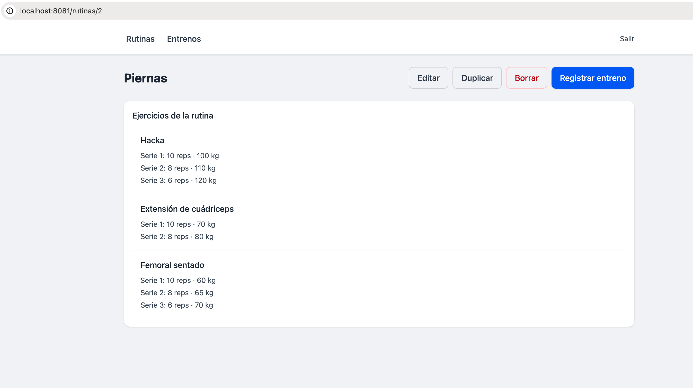

*vista de detalle de rutina en funcionamiento dentro de la SPA.*

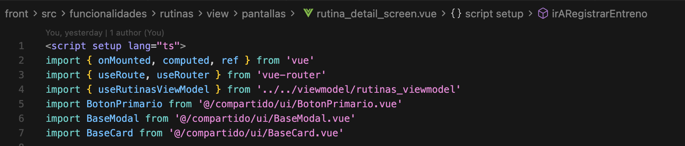

*uso de `script setup lang="ts"` en un componente real del proyecto.*

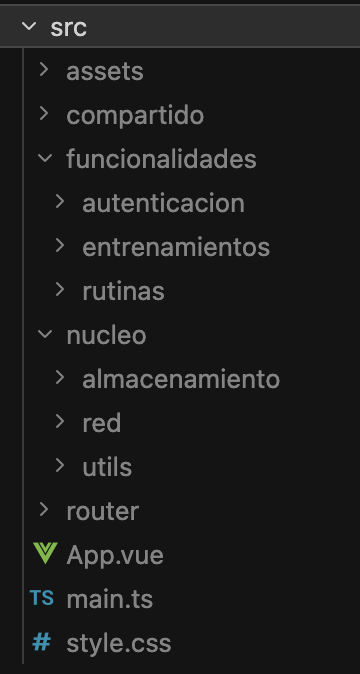

*organización del frontend por dominios funcionales y capas compartidas.*

---

### 3.2 Router

La navegación está definida en `router/index.ts`:

- Rutas públicas: `/login`, `/registro`
- Rutas protegidas: `/rutinas`, `/rutinas/:id`, `/entrenos`, `/entrenos/:id`

Existe un `beforeEach` que:

- Permite acceso a rutas públicas sin sesión  
- Redirige a `/login` si no hay token  
- Valida sesión mediante `asegurarSesion()`  
- Evita volver a login si el usuario ya está autenticado  

Esto demuestra control real de navegación y de acceso en cliente.

**Evidencia:**

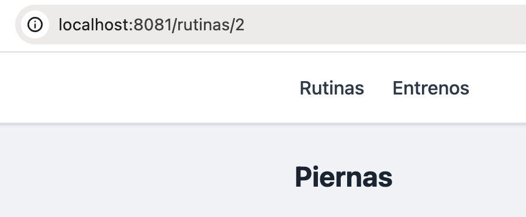

*navegación entre rutas de la aplicación SPA (`/rutinas → /rutinas/:id`).*

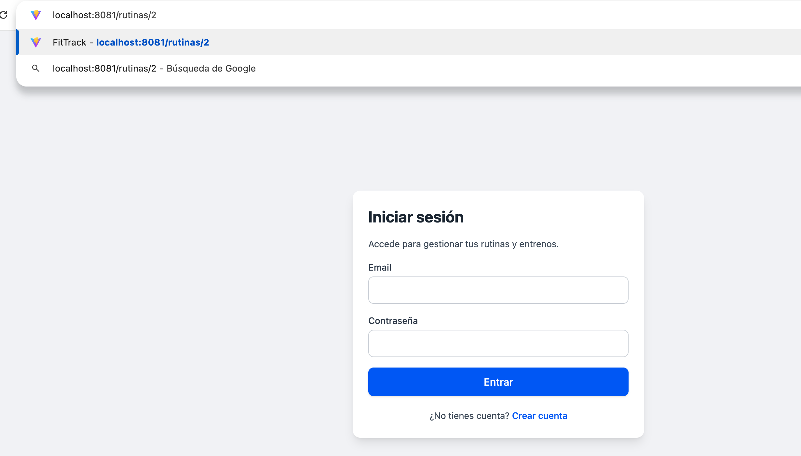

*control de acceso mediante guard del router, redirigiendo a `/login` sin sesión activa.*

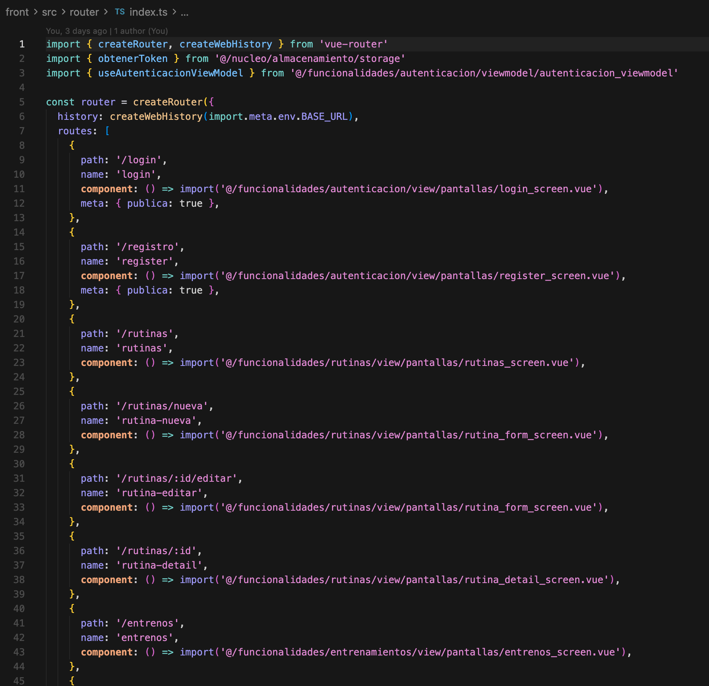

*definición de rutas en `router/index.ts`.*

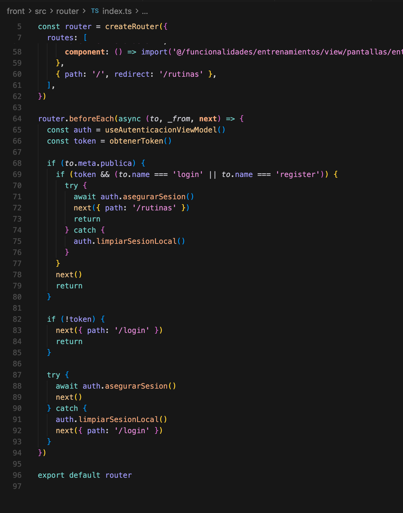

*uso de `beforeEach` para control de acceso y validación de sesión en cliente.*

---

### 3.3 Reactividad (`ref`, `reactive`, `computed`)

La reactividad se usa en casos reales del flujo de la aplicación:

- Formularios (`login`, `registro`, entreno)  
- Estados de UI (carga, error, modales)  
- Datos derivados (orden, filtros, resumen de entreno)  

Ejemplos:

- `rutinas_screen.vue`: búsqueda reactiva y orden persistido  
- `entreno_form_desde_rutina_screen.vue`: control de series, cronómetro y resumen en tiempo real  
- Stores Pinia: estado base con `ref` y derivados con `computed`  

**Evidencia:**

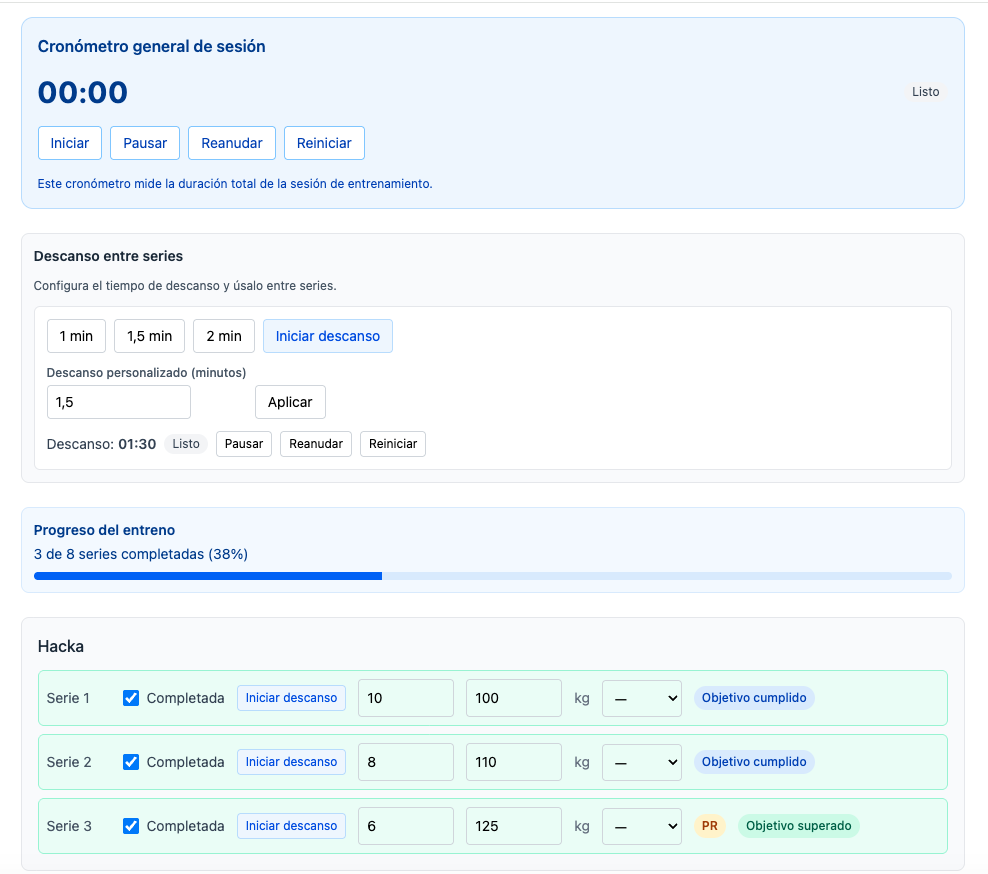

*actualización de la interfaz en tiempo real durante el registro de un entreno (cronómetro, descanso y progreso).*

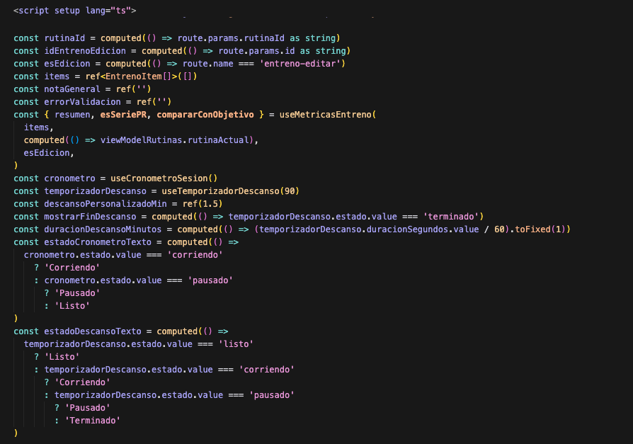

*definición de estado reactivo (`ref`) y cálculo de valores derivados (`computed`) en el formulario de entreno.*

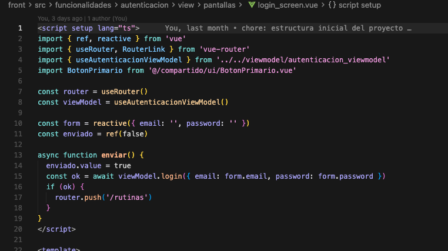

*uso de `reactive` para modelar el estado del formulario de autenticación.*

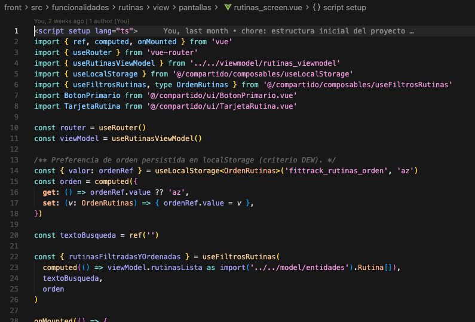

*uso de `computed` para gestionar orden y filtrado de rutinas.*

---

### 3.4 Gestión de estado (Pinia)

El estado global se organiza por dominios:

- `useAutenticacionViewModel`: login, registro, sesión y logout  
- `useRutinasViewModel`: CRUD de rutinas  
- `useEntrenamientosViewModel`: gestión de entrenos  

Cada store:

- Mantiene estado reactivo (`cargando`, `error`, datos)  
- Gestiona acciones asíncronas  
- Expone una API clara para las vistas  

**Evidencia:**

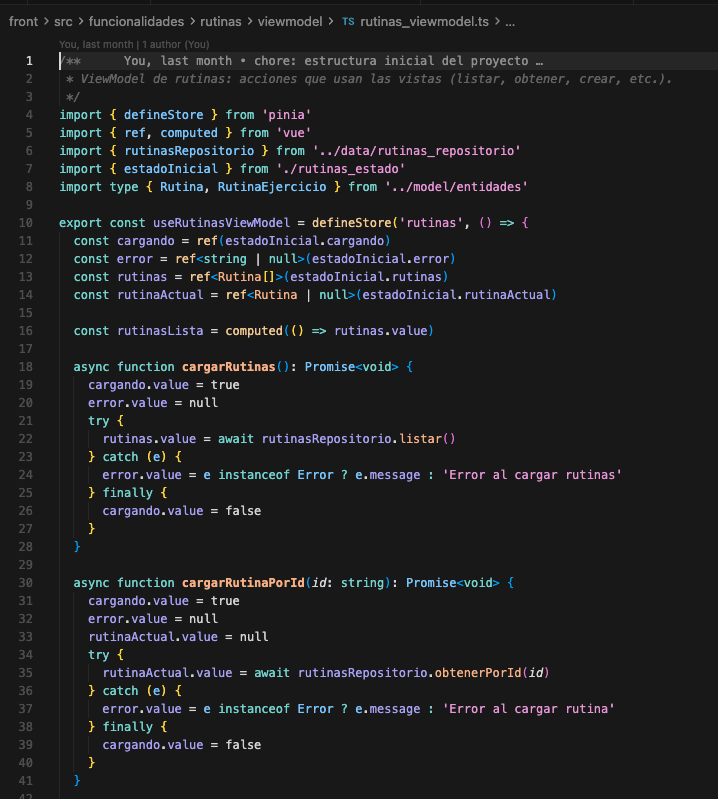

*definición de una store mediante `defineStore`, incluyendo estado reactivo y acciones asíncronas.*

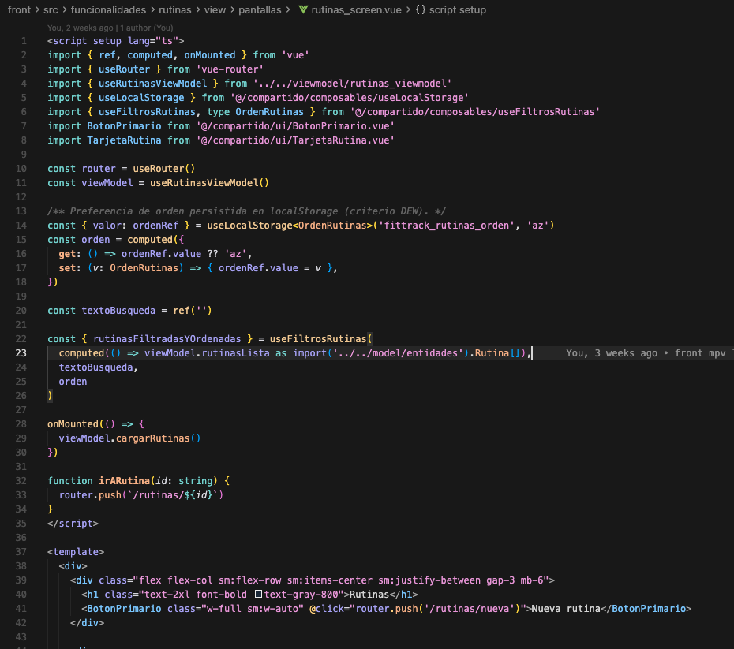

*uso de la store en una vista mediante `useRutinasViewModel`.*

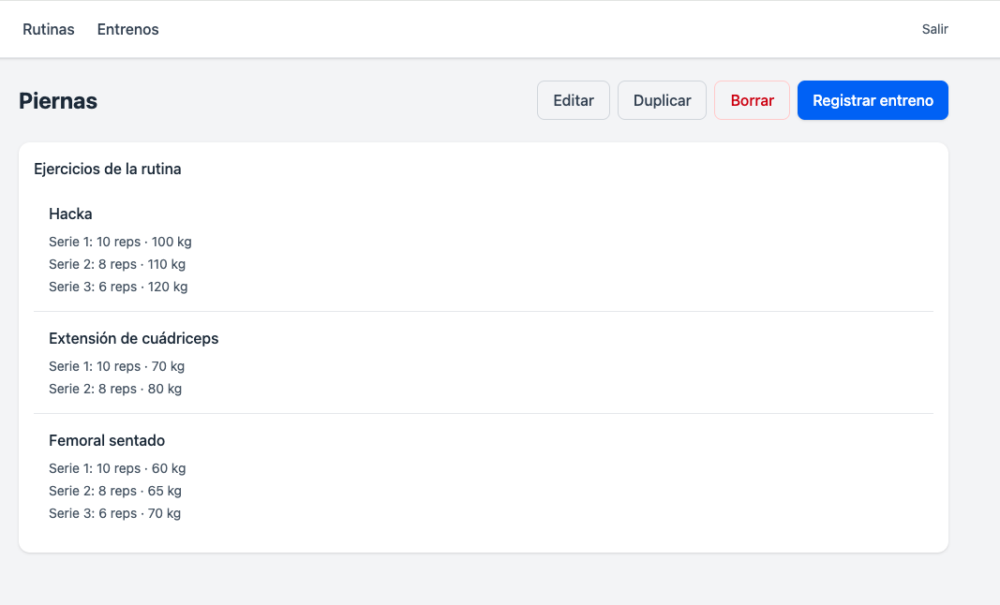

*visualización de datos gestionados por Pinia en la interfaz de usuario.*

---

### 3.5 Props / emits

La comunicación entre componentes es unidireccional:

- `TarjetaRutina.vue`: recibe datos por `props` y emite `ver`  
- `BaseModal.vue`: recibe `visible` y emite `cerrar`  
- `BotonPrimario.vue`: emite interacción reutilizable  

Esto mantiene bajo acoplamiento y facilita la reutilización.

**Evidencia:**

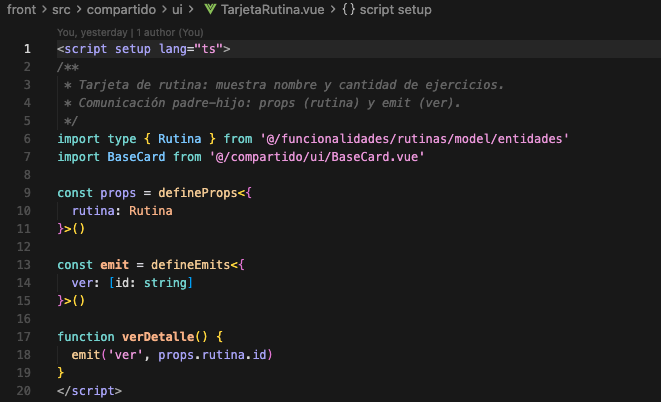

*definición de `defineProps` y `defineEmits` en el componente `TarjetaRutina.vue`.*

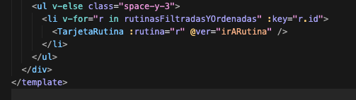

*uso del componente `TarjetaRutina` desde la vista, pasando datos por prop y escuchando el evento `@ver`.*

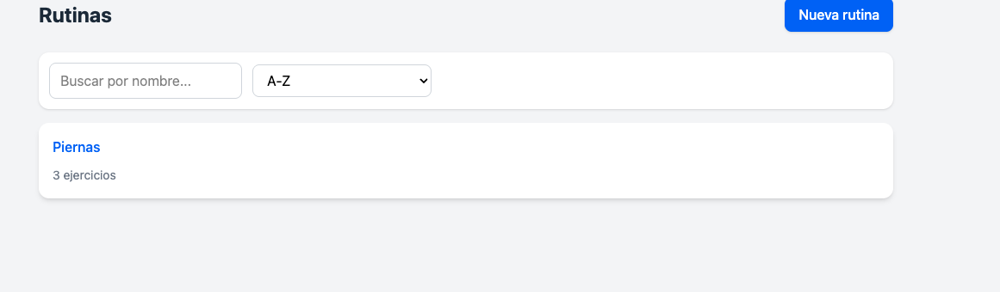

*listado de rutinas mostrado en interfaz mediante componentes reutilizables.*

---

### 3.6 `localStorage` y `sessionStorage`

Se utilizan con objetivos distintos:

**localStorage**
- Token de sesión (`storage.ts`)  
- Preferencias del usuario (`useLocalStorage`)  

**sessionStorage**
- Entreno en curso (`useEntrenamientoEnCurso`)  

Esto demuestra uso correcto según ciclo de vida del dato.

**Evidencia:**

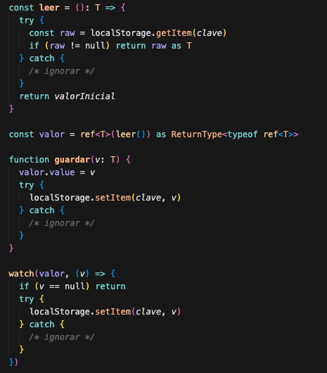

*: uso de `localStorage` en un composable reutilizable para persistir preferencias del usuario.*

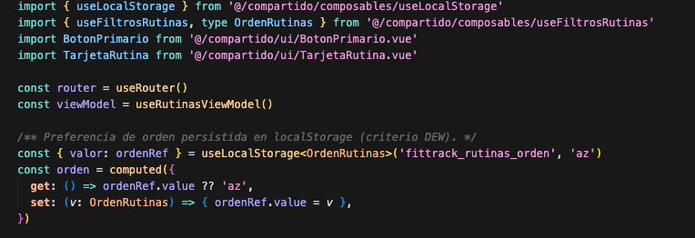

*uso de `useLocalStorage` en `rutinas_screen.vue` para mantener el orden seleccionado entre recargas.*

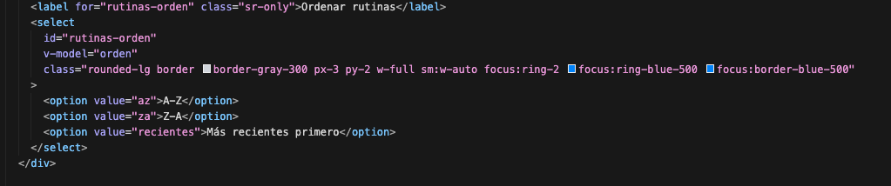

*selección de orden en la interfaz conectada con el estado persistido.*

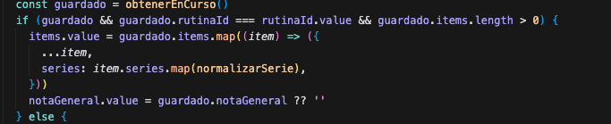

*recuperación del estado de un entreno en curso desde `sessionStorage` tras recargar la página.*

---

### 3.7 Slots

Los slots permiten reutilizar estructura:

- `BaseModal.vue`: `titulo`, `default`, `pie`  
- `BaseCard.vue`: `titulo`, `default`, `acciones`  

Uso real:

- Pantallas usan `BaseModal` para modales  
- `TarjetaRutina` compone `BaseCard`  

**Evidencia:**

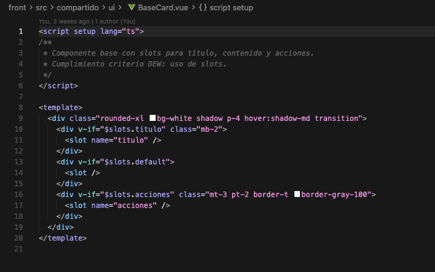

*definición de slots (`titulo`, `default`, `acciones`) en el componente base `BaseCard.vue`.*

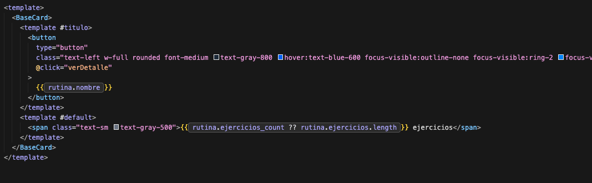

*uso de slots (`#titulo`, `#default`) para personalizar el contenido en el componente `TarjetaRutina`.*

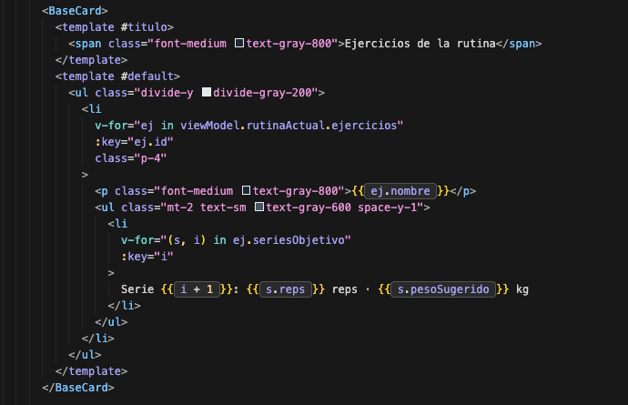

*uso de slots para renderizar contenido dinámico complejo en una vista de detalle de rutina.*

---

### 3.8 Composables

La lógica reutilizable se encapsula en composables:

- `useMetricasEntreno`  
- `useCronometroSesion`  
- `useTemporizadorDescanso`  
- `useEntrenamientoEnCurso`  
- `useLocalStorage`  
- `useFiltrosRutinas`  

Esto permite separar lógica de la vista y mejorar mantenibilidad.

**Evidencia:**
- En `entreno_form_desde_rutina_screen.vue` se usan composables reales del proyecto como `useCronometroSesion`, `useTemporizadorDescanso`, `useMetricasEntreno` y `useEntrenamientoEnCurso`.
- Estos composables encapsulan lógica reutilizable con estado y derivados (`ref`, `computed`) junto con funciones de operación (iniciar, pausar, reanudar, calcular métricas, guardar/recuperar estado, etc.).
- La vista consume esos composables mediante desestructuración (por ejemplo, `const { resumen, esSeriePR, compararConObjetivo } = useMetricasEntreno(...)` y `const { obtener, guardar, limpiar } = useEntrenamientoEnCurso()`).
- El resultado es una separación clara entre lógica y presentación: la pantalla se centra en renderizar e interactuar con la UI, mientras la lógica de cronómetro, descanso, métricas y persistencia queda aislada en composables.

---

## 4. Conclusión DEW

El frontend de FitTrack cumple de forma práctica y verificable todos los criterios DEW:

- Vue 3 + TypeScript con Composition API  
- SPA con Router y control de acceso  
- Reactividad aplicada a casos reales  
- Estado con Pinia  
- Comunicación con props/emits  
- Uso de slots  
- Persistencia con storage  
- Uso de composables  
- Preparación para defensa  
- Documentación alineada  
