# 4. Backend (DSW)

## 1. Introducción

El backend de FitTrack está construido con Laravel sobre PostgreSQL, siguiendo un enfoque de API REST como capa de comunicación con el frontend.

Su función es gestionar la lógica de negocio, persistir los datos y ofrecer un contrato claro para el flujo de planificación y registro de entrenamientos.

Este apartado se centra en DSW (Desarrollo web en entorno servidor) y demuestra el cumplimiento de los criterios aplicados al proyecto real.

---

## 2. Uso de NGINX como servidor

**Explicación aplicada al proyecto**  
La aplicación se despliega utilizando NGINX como servidor web, encargado de servir el frontend y redirigir las peticiones al backend.

**Dónde se usa**  
- NGINX actúa como servidor principal en el despliegue con Docker  
- Redirige peticiones hacia PHP-FPM (Laravel)  
- Sirve los archivos del frontend y gestiona rutas  

**Por qué está bien implementado**  
Se utiliza una arquitectura real de despliegue, separando servidor web y backend, lo que permite simular un entorno de producción.

**Evidencia**

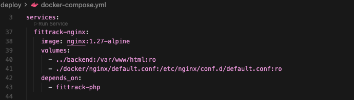

*Configuración del servicio NGINX en docker-compose.*

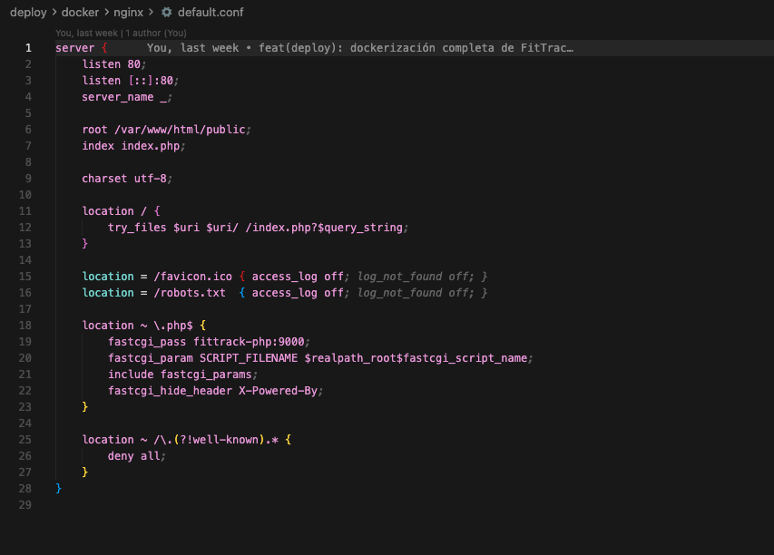

*NGINX conectado a PHP-FPM mediante fastcgi.*

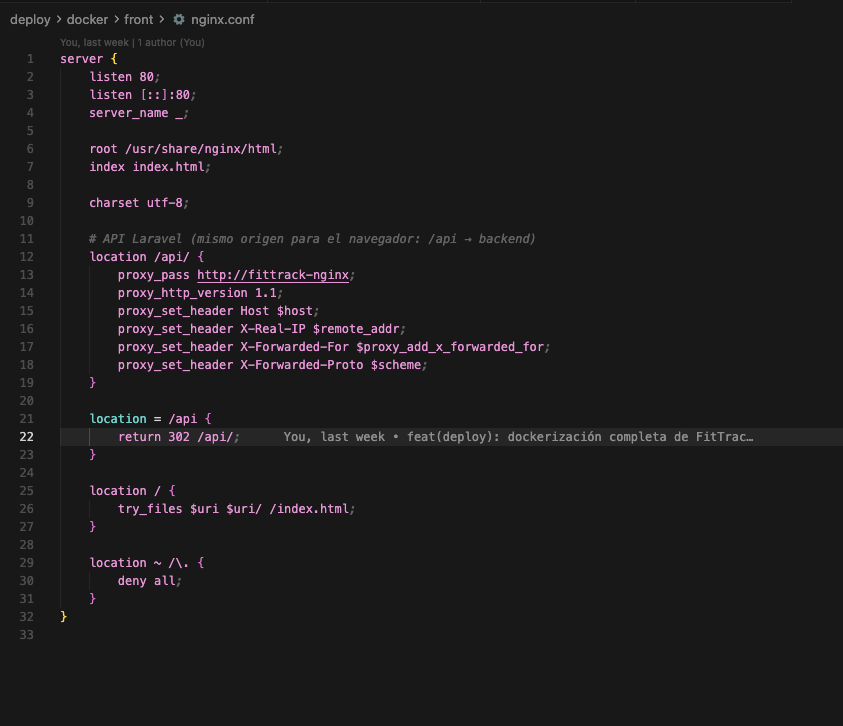

*Redirección de /api desde frontend hacia backend.*

---

## 3. Uso de PHP como backend

**Explicación aplicada al proyecto**  
El backend está desarrollado en PHP mediante el framework Laravel, que gestiona la lógica de negocio y el acceso a datos.

**Dónde se usa**  
- Controladores para gestionar peticiones HTTP  
- Modelos Eloquent para representar entidades  
- Validaciones en endpoints  

**Por qué está bien implementado**  
Se utiliza PHP dentro de un framework estructurado, evitando código desorganizado y manteniendo separación de responsabilidades.

**Evidencia**

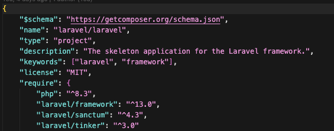

*Configuración del backend sobre entorno PHP en `composer.json`.*

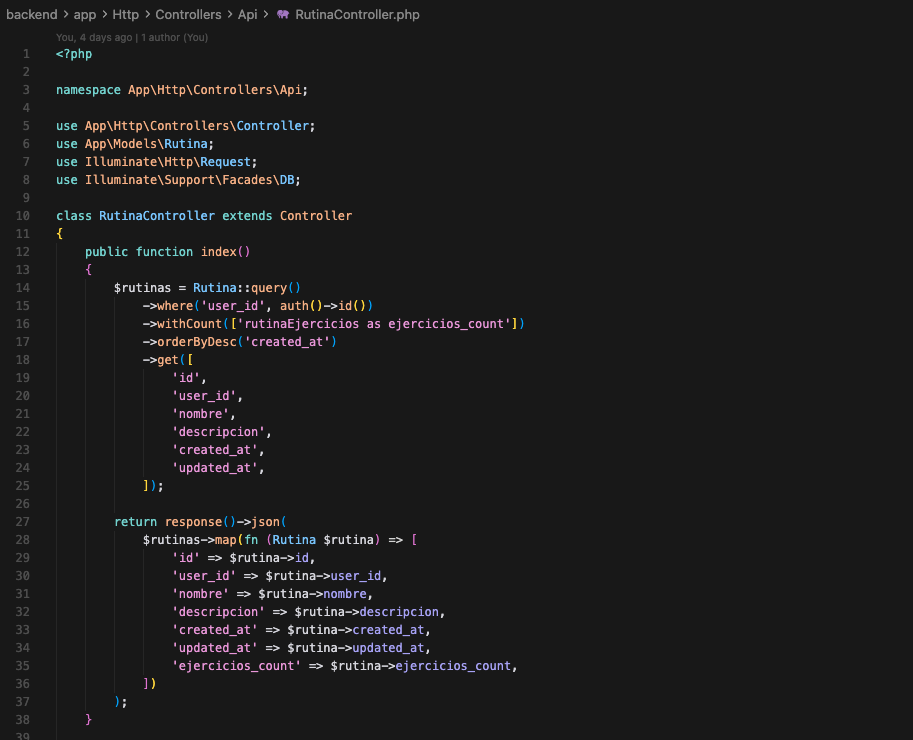

*Ejemplo de lógica backend implementada en un controlador Laravel escrito en PHP.*

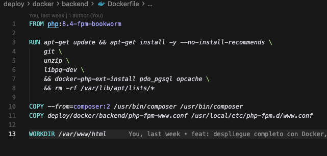

*Uso de una imagen base PHP-FPM en el despliegue del backend.*
---

## 4. Uso de Laravel

**Explicación aplicada al proyecto**  
Laravel se utiliza como framework principal del backend, aportando estructura MVC, routing, ORM y herramientas de validación.

**Dónde se usa**  
- Definición de rutas en `routes/api.php`  
- Controladores (`RutinaController`, etc.)  
- Modelos (`Rutina`, `RutinaEjercicio`, `RutinaSerie`)  
- Uso de migraciones para la base de datos  

**Por qué está bien implementado**  
El proyecto sigue la estructura propia de Laravel, facilitando mantenimiento, escalabilidad y claridad en la defensa.

**Evidencia**

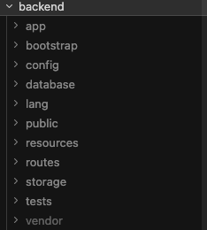

*Estructura base del backend siguiendo la organización propia de Laravel.*

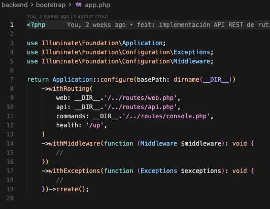

*Configuración de arranque y routing en `bootstrap/app.php`.*

*Definición de rutas API mediante el sistema de routing de Laravel.*

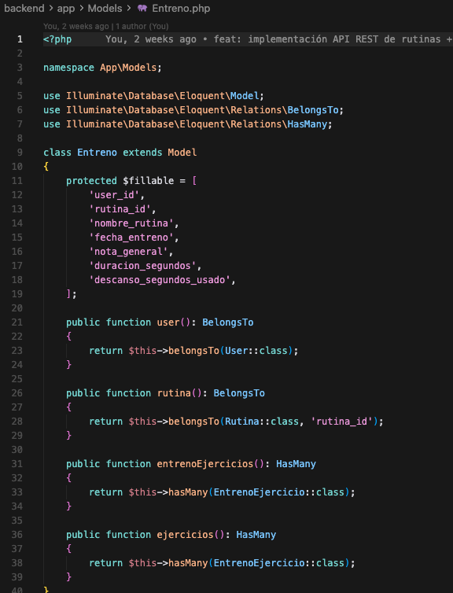

*Uso de modelos para estructurar los datos del backend.*
---

## 5. Implementación de API REST

**Explicación aplicada al proyecto**  
El backend expone una API REST que permite al frontend interactuar con el sistema de forma estructurada.

**Endpoints principales**

Base: `/api/rutinas`

- `GET /rutinas` → listado de rutinas  
- `GET /rutinas/{id}` → detalle de rutina  
- `POST /rutinas` → creación de rutina  
- `PUT /rutinas/{id}` → actualización  
- `DELETE /rutinas/{id}` → eliminación  
- `POST /rutinas/{id}/duplicar` → duplicado de rutina  

Además, se incluyen endpoints de autenticación y entrenos:

- `/api/auth/*` (login, registro, usuario)  
- `/api/entrenos` (gestión de entrenos)

**Por qué está bien implementado**  
Los endpoints cubren un flujo funcional completo y no se limitan a operaciones básicas, incluyendo acciones propias del dominio como duplicar rutinas.

Además, la API es consumida directamente por el frontend, lo que demuestra su uso real dentro de la aplicación.

**Evidencia**

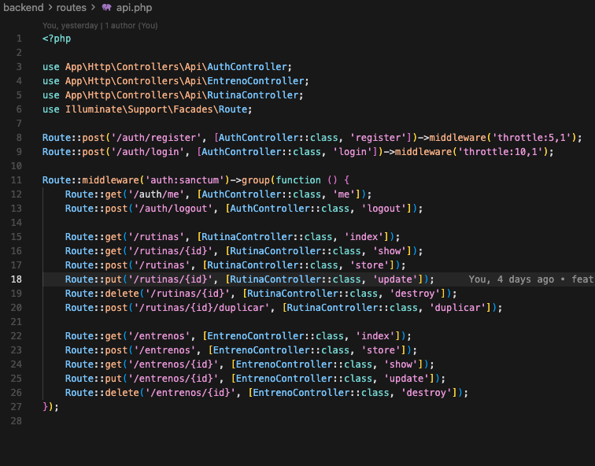

*Definición de endpoints REST en `routes/api.php`.*

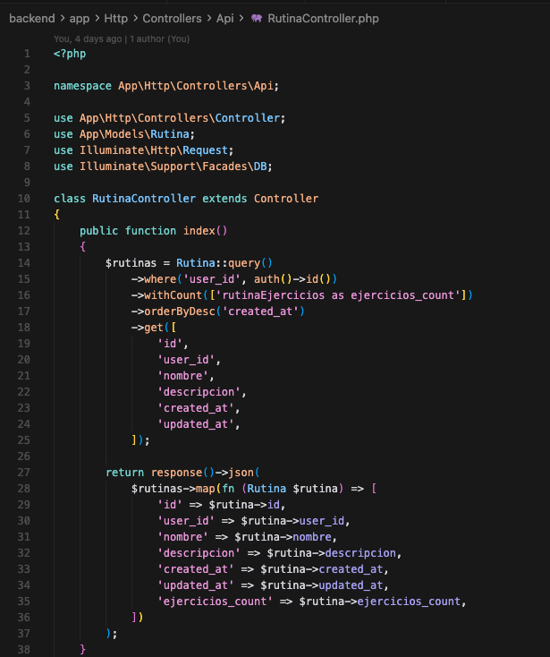

*Implementación de operaciones REST y lógica de dominio en `RutinaController.php`.*

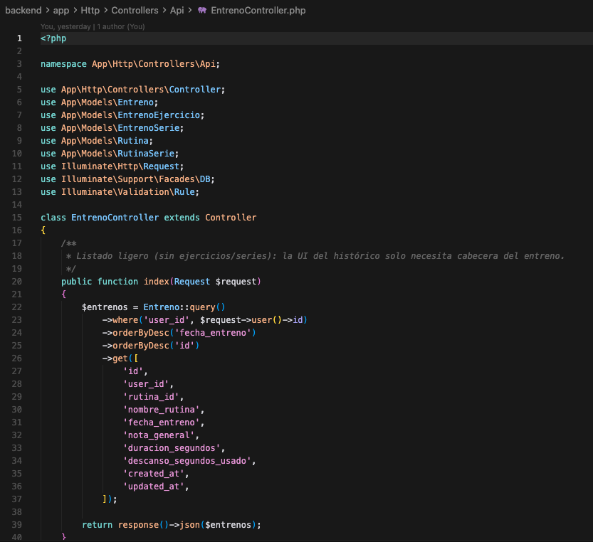

*Implementación de endpoints de entrenos con validación y lógica de negocio en `EntrenoController.php`.*

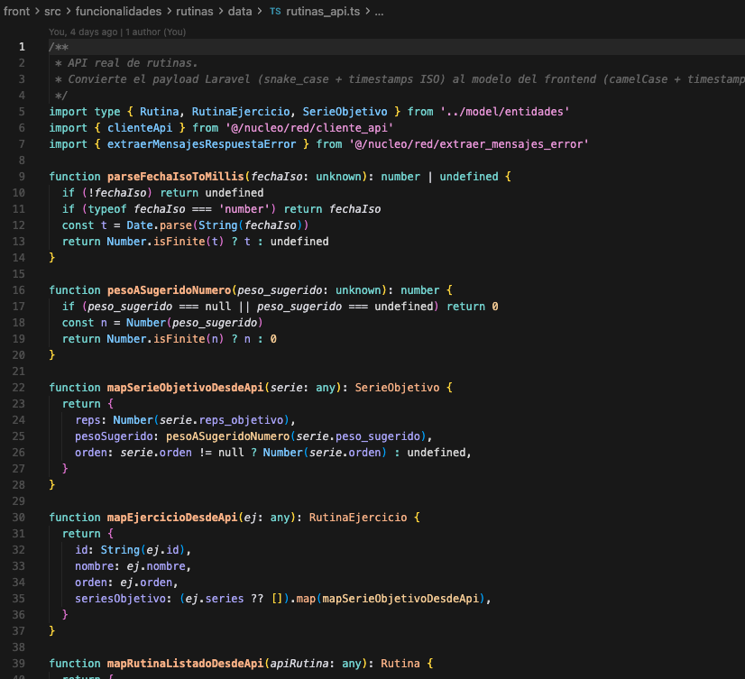

*Consumo real de la API REST desde el frontend mediante cliente HTTP.*
---

## 6. Modelo de datos y base de datos (PostgreSQL)

**Explicación aplicada al proyecto**  
La base de datos utilizada es PostgreSQL, donde se modela la información de planificación y registro de entrenamientos.

**Estructura principal**

- `rutinas`
- `rutina_ejercicios`
- `rutina_series`
- `entrenos`
- `entreno_ejercicios`
- `entreno_series`

**Por qué está bien implementado**  
Se separa correctamente:

- **Planificación (plantilla)** → rutinas  
- **Ejecución (histórico)** → entrenos  

Esto permite mantener coherencia en los datos y evita mezclar información de uso con definición de estructura.

Además, las tablas están relacionadas mediante claves foráneas (por ejemplo, `user_id`, `rutina_id` o `entreno_id`), lo que garantiza la integridad de los datos.

La estructura de la base de datos se define mediante migraciones de Laravel, asegurando que el modelo de datos esté versionado y sea reproducible en cualquier entorno.

**Evidencia**

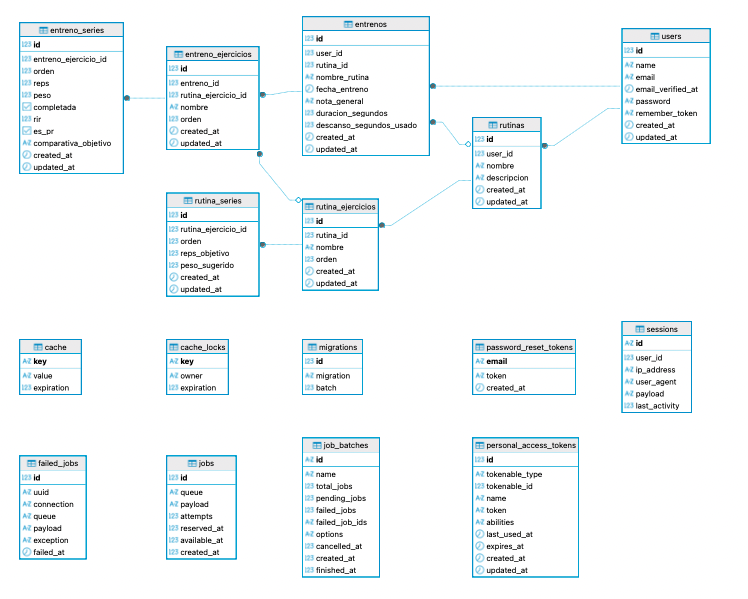

*Diagrama de la base de datos generado con DBeaver, mostrando las relaciones entre rutinas, ejercicios y entrenos.*

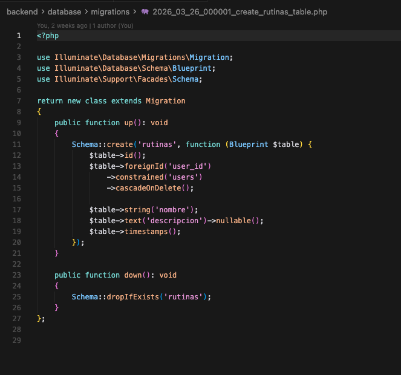

*Definición de la tabla `rutinas` mediante migraciones Laravel, incluyendo claves foráneas y estructura de datos.*
---

## 9. Conclusión DSW

El backend de FitTrack cumple los criterios de DSW: uso de NGINX como servidor, desarrollo en PHP mediante Laravel, implementación de una API REST funcional y estructurada, y uso de una base de datos relacional (PostgreSQL) correctamente modelada.

Todos estos elementos están integrados en un sistema real y preparados para su demostración en la defensa.