# 5. Despliegue (DPL)

## 1. Introducción

El despliegue de FitTrack se basa en una arquitectura por servicios que separa frontend, backend y base de datos.

Se utilizan herramientas como Docker, Docker Compose, NGINX, Portainer y GitHub Actions para definir un entorno reproducible, controlado y preparado para su defensa.

Este apartado demuestra el cumplimiento de los criterios de DPL aplicados al proyecto.

---

## 2. Configuración del entorno (Docker + NGINX)

**Explicación aplicada al proyecto**  
La aplicación se ejecuta mediante contenedores Docker que encapsulan cada parte del sistema.

**Servicios definidos**

- Frontend: servido con NGINX  
- Backend: Laravel ejecutándose sobre PHP-FPM  
- Base de datos: PostgreSQL  

**Por qué está bien implementado**  
Cada servicio está aislado, lo que permite reproducir el entorno completo en cualquier máquina sin configuraciones manuales.

**Evidencia**

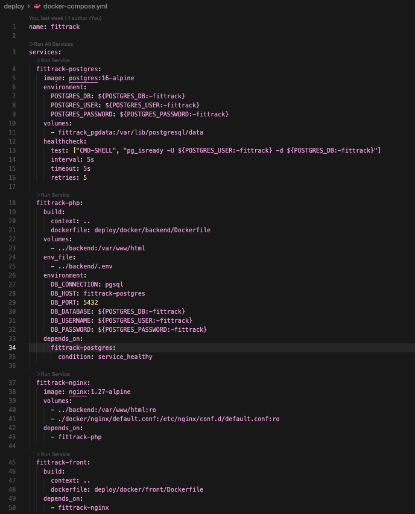

*Definición de servicios en docker-compose.*

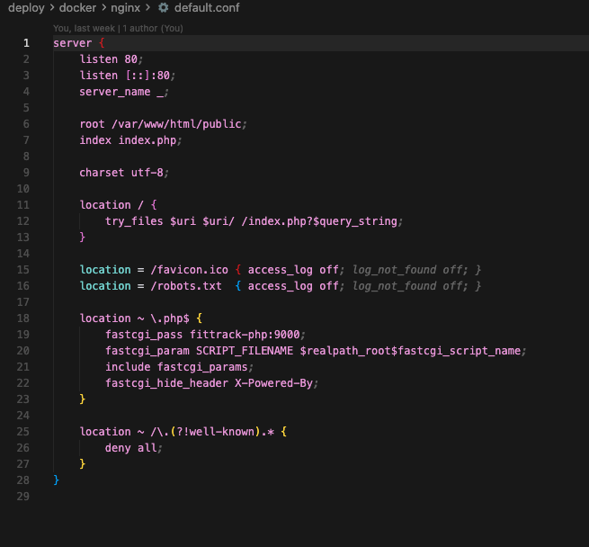

*Configuración de NGINX para servir frontend y conectar con backend.*

---

## 3. Orquestación con Docker Compose

**Explicación aplicada al proyecto**  
Se utiliza Docker Compose para levantar todos los servicios del sistema de forma conjunta.

**Qué permite**

- Iniciar frontend, backend y base de datos con un solo comando  
- Definir dependencias entre servicios  
- Mantener un entorno consistente  

**Por qué está bien implementado**  
Se utiliza una solución adecuada al alcance del proyecto, gestionando servicios y dependencias sin añadir complejidad innecesaria.

**Evidencia**

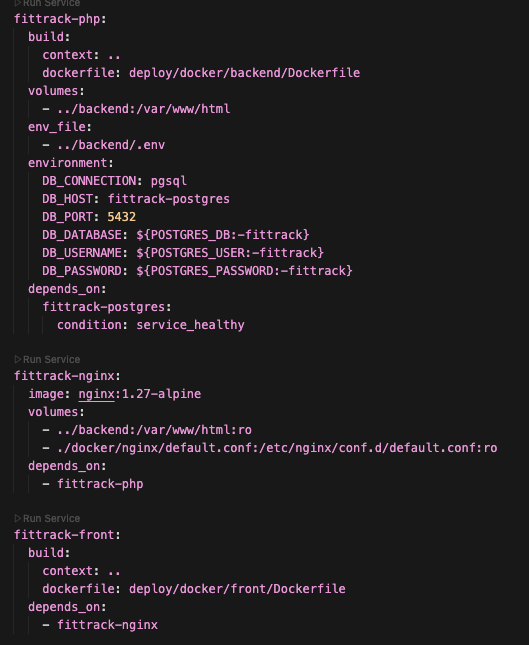

*Orquestación de servicios mediante Docker Compose.*

---

## 4. Entornos diferenciados (staging / producción)

**Explicación aplicada al proyecto**  
El proyecto define dos entornos mediante archivos Docker Compose adicionales:

- Staging  
- Producción  

**Diferencias**

- Configuración de variables de entorno  
- Puertos expuestos  
- Nivel de debug  
- Exposición de la base de datos  

**Por qué está bien implementado**  
Se utiliza Docker Compose con archivos específicos (`docker-compose.staging.yml` y `docker-compose.prod.yml`), lo que permite adaptar el comportamiento del sistema según el entorno sin duplicar configuración.

Además, el despliegue de los contenedores se gestiona mediante Portainer, lo que permite visualizar, controlar y administrar los servicios Docker de forma gráfica.

Esto facilita la gestión de entornos sin necesidad de ejecutar comandos manuales directamente.

**Evidencia**

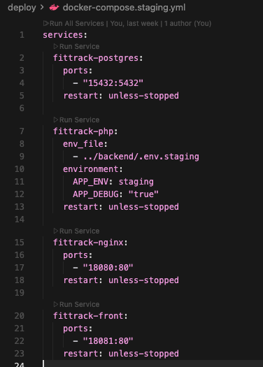

*Configuración del entorno de staging.*

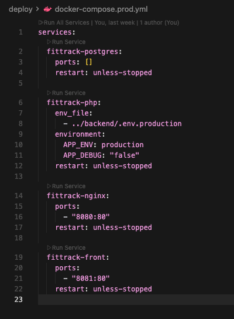

*Configuración del entorno de producción.*

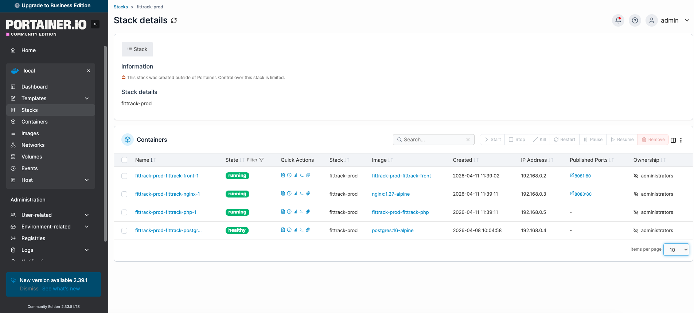

*Contenedores en entorno de producción gestionados con Portainer.*

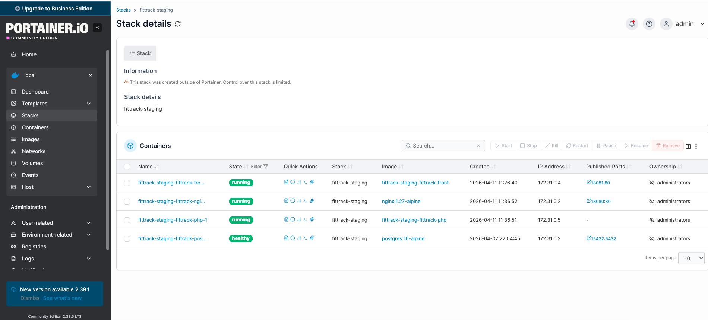

*Contenedores en entorno de staging con diferentes configuraciones.*
---

## 5. Control de versiones (Git)

**Explicación aplicada al proyecto**  
El proyecto utiliza Git para el seguimiento del desarrollo.

**Dónde se aplica**

- Gestión de versiones del código  
- Control de cambios  
- Integración con GitHub  

**Por qué está bien implementado**  
Permite mantener trazabilidad del proyecto y facilita el uso de herramientas automáticas como CI/CD.

**Evidencia**

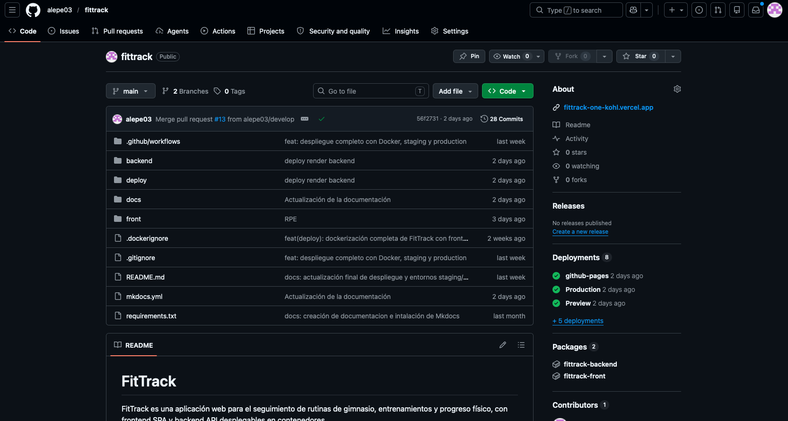

*Historial de commits del proyecto.*

---

## 6. Integración continua y despliegue (CI/CD)

**Explicación aplicada al proyecto**  
Se utiliza GitHub Actions para automatizar procesos del proyecto.

**Qué se automatiza**

- Build del frontend  
- Tests del backend  
- Generación de documentación  
- Publicación de documentación en GitHub Pages  
- Construcción y publicación de imágenes Docker  

**Por qué está bien implementado**  
Se automatizan tareas clave del desarrollo, asegurando consistencia en el código y en la documentación.

Actualmente, el despliegue completo del stack (frontend + backend + base de datos) en un servidor externo se realiza de forma manual mediante Docker Compose.

**Evidencia**

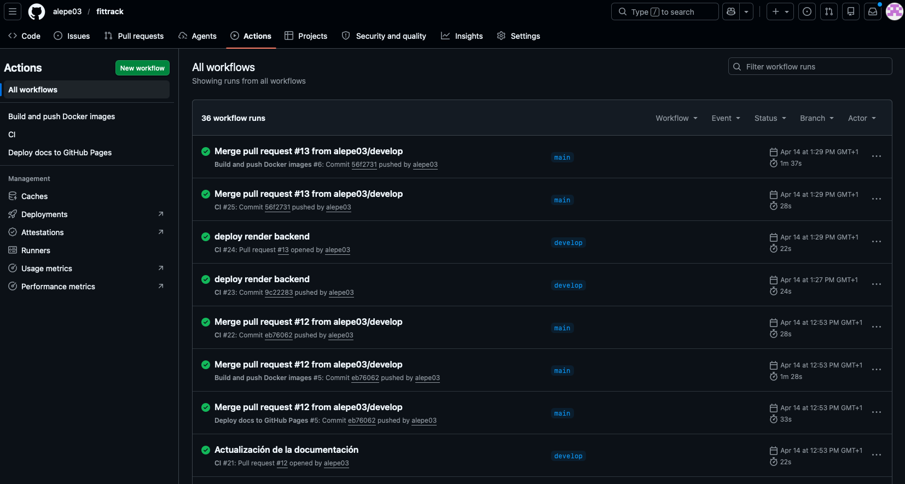

*Pipeline de GitHub Actions ejecutando build y validaciones.*

---

## 7. Documentación del proyecto

**Explicación aplicada al proyecto**  
La documentación se genera mediante MkDocs.

**Características**

- Estructura modular por apartados (DEW, DSW, DPL, etc.)  
- Navegación clara  
- Contenido preparado para defensa  

**Por qué está bien implementado**  
Permite mantener documentación actualizada y alineada con el desarrollo del proyecto.

**Evidencia**

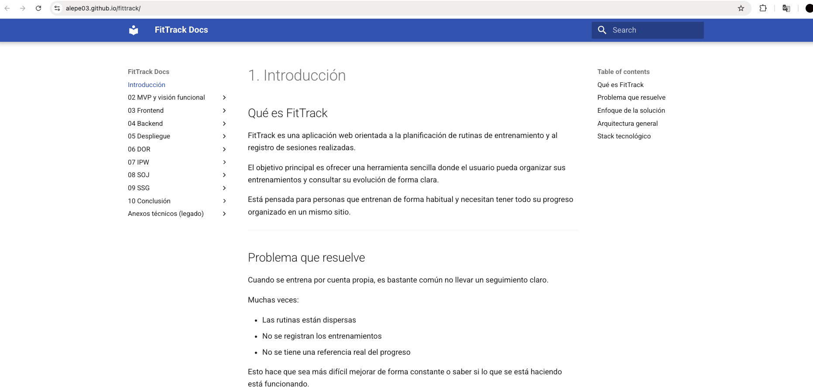

*Configuración de MkDocs y estructura de documentación.*

---

## 8. Despliegue de la documentación

**Explicación aplicada al proyecto**  
La documentación se publica automáticamente mediante GitHub Pages.

**Qué permite**

- Acceso público a la documentación  
- Visualización del proyecto sin necesidad de ejecutar código  

**Por qué está bien implementado**  
Demuestra integración con herramientas reales de despliegue y facilita la evaluación del proyecto.

**Evidencia**

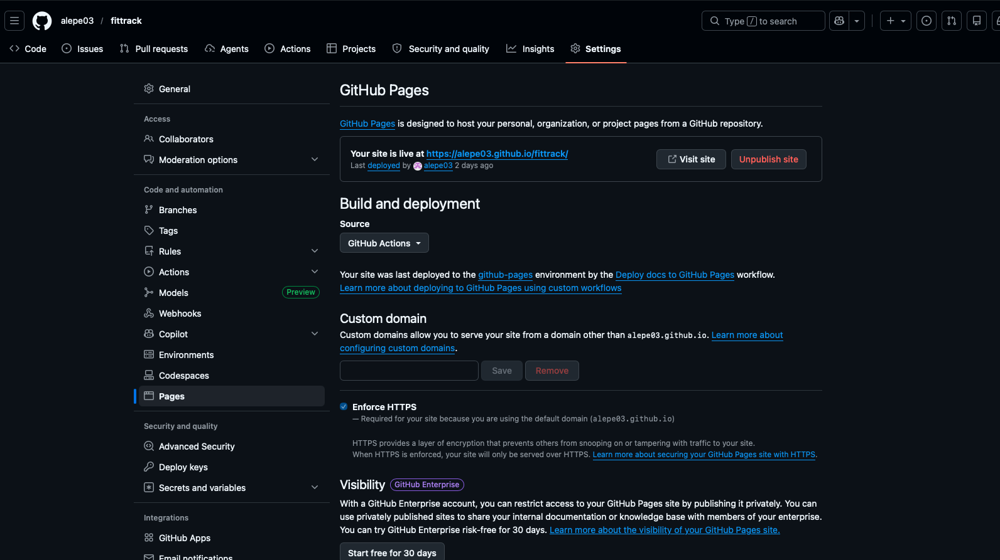

*Despliegue automático de la documentación mediante GitHub Pages.*

---

## 10. Conclusión DPL

El despliegue de FitTrack cumple los criterios de DPL: uso de Docker y NGINX, orquestación con Docker Compose, separación de entornos, control de versiones con Git, integración continua mediante GitHub Actions y documentación generada y desplegada con MkDocs y GitHub Pages.

