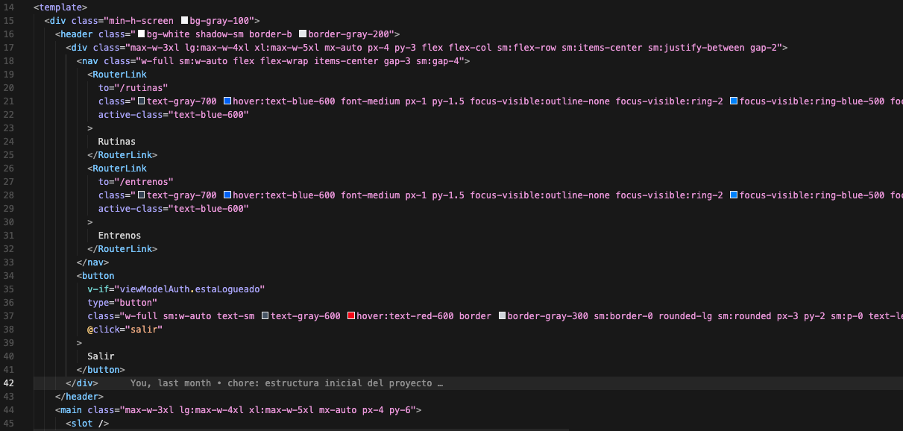
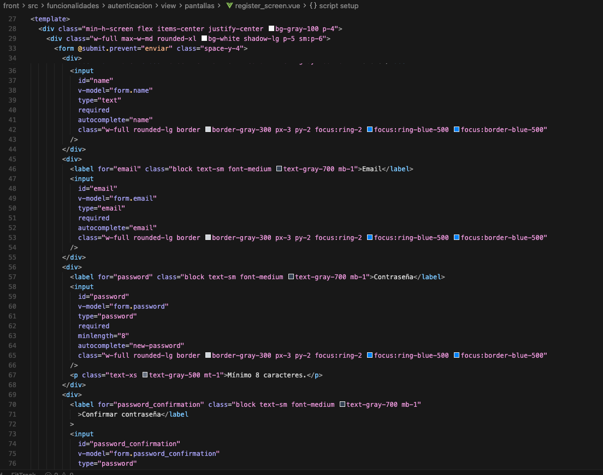
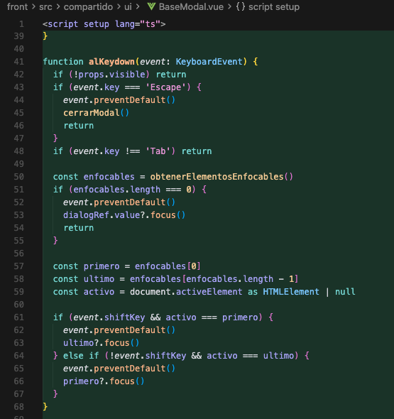
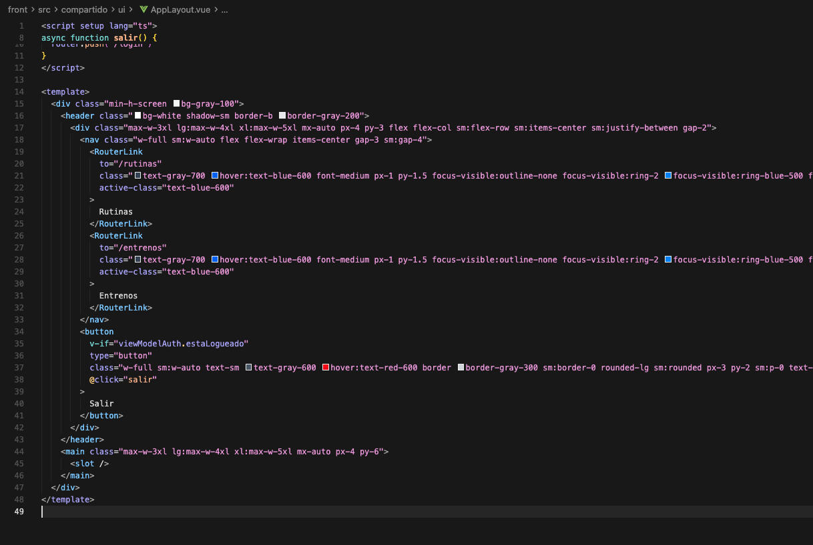
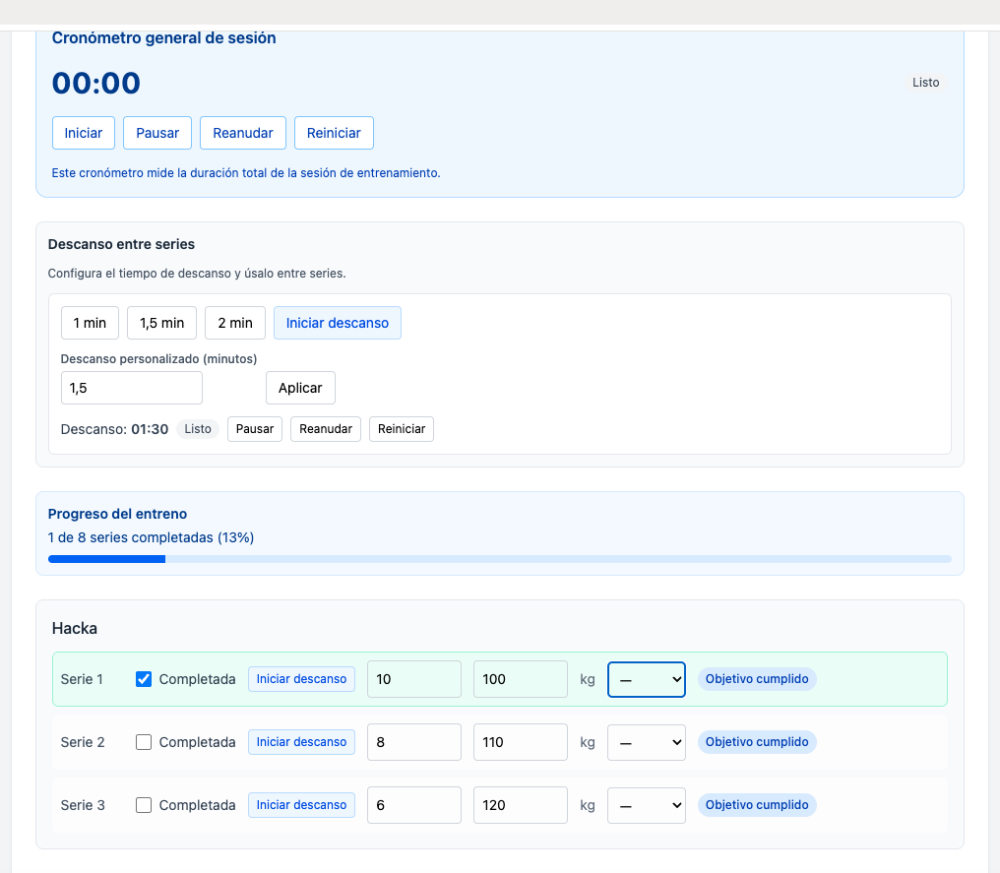

# 6. Diseño de interfaces (DOR)

## 1. Introducción

El diseño de FitTrack se centra en facilitar el uso de la aplicación, priorizando claridad, simplicidad y coherencia en la interfaz.

El objetivo principal es que el usuario pueda realizar las acciones clave (gestionar rutinas y registrar entrenamientos) de forma rápida y sin fricción.

Este apartado demuestra el cumplimiento de los criterios de DOR aplicados al proyecto.

---

## 2. Diseño responsive

**Explicación aplicada al proyecto**  
La aplicación sigue un enfoque mobile-first, adaptando la interfaz a distintos tamaños de pantalla.

**Dónde se aplica**

- Layouts con contenedores adaptativos  
- Uso de clases responsive de Tailwind (`sm`, `md`, `lg`)  
- Formularios y listados ajustados a móvil y escritorio  

**Por qué está bien implementado**  
El flujo principal se mantiene usable en cualquier dispositivo, sin pérdida de funcionalidad.

**Evidencia**

*Adaptación del layout entre móvil y escritorio mediante clases responsive.*

---

## 3. Accesibilidad (WCAG)

**Explicación aplicada al proyecto**  
Se aplican criterios básicos de accesibilidad enfocados a casos reales de uso.

**Dónde se aplica**

- Labels asociados a inputs  
- Mensajes de error con `role="alert"`  
- Navegación por teclado en modales  
- Uso de `focus-visible` en elementos principales  

**Por qué está bien implementado**  
La interfaz es usable sin depender exclusivamente del ratón y proporciona feedback claro al usuario.

No obstante, la accesibilidad no es homogénea en toda la aplicación, especialmente en botones secundarios y formularios complejos.

**Evidencia**

*Inputs con label, validación y mensajes accesibles.*

*Modal con navegación por teclado, foco controlado y cierre mediante Escape.*

---

## 4. Uso de framework CSS

**Explicación aplicada al proyecto**  
Se utiliza Tailwind CSS como framework principal de estilos.

**Dónde se usa**

- Formularios  
- Tarjetas  
- Botones  
- Modales  
- Layout general  

**Por qué está bien implementado**  
Permite mantener consistencia visual, reutilizar patrones y evitar estilos desordenados.

**Evidencia**

*Uso de clases utilitarias de Tailwind en componentes del proyecto.*

---

## 5. Gama de colores

**Explicación aplicada al proyecto**  
La aplicación utiliza una paleta de colores coherente orientada a claridad visual.

**Dónde se aplica**

- Azul para acciones principales  
- Rojo para acciones destructivas o errores  
- Verde y ámbar para estados (progreso, logros)  
- Fondo neutro para facilitar lectura  

**Por qué está bien implementado**  
Se mantiene coherencia visual en toda la aplicación y una diferenciación clara entre tipos de acciones.

No obstante, no se ha realizado una validación formal de contraste WCAG, por lo que algunos tonos pueden requerir verificación adicional.

**Evidencia**

*Uso consistente de colores en distintas pantallas de la aplicación.*

---

## 6. Usabilidad

**Explicación aplicada al proyecto**  
La interfaz está diseñada en función del flujo real del usuario.

**Dónde se aplica**

- Pantallas de listado, detalle y formulario  
- Acciones principales visibles (crear, editar, guardar)  
- Feedback en acciones (carga, error, confirmación)  

**Por qué está bien implementado**  
El usuario puede completar tareas sin ambigüedad, siguiendo un flujo claro.

Se proporciona feedback visual en los momentos clave del uso de la aplicación.

**Evidencia**

*Flujo completo de uso desde rutinas hasta registro de entreno.*

---

## 9. Conclusión DOR

El diseño de FitTrack cumple los criterios de DOR: interfaz responsive, aplicación de criterios básicos de accesibilidad, uso de framework CSS (Tailwind), coherencia en la gama de colores y cumplimiento de criterios de usabilidad.