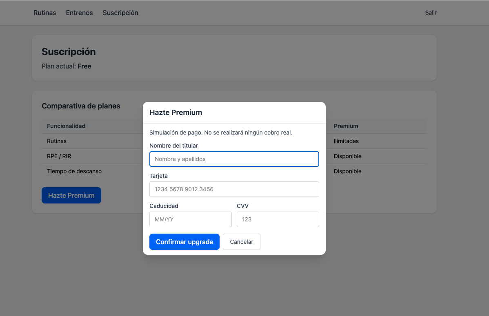
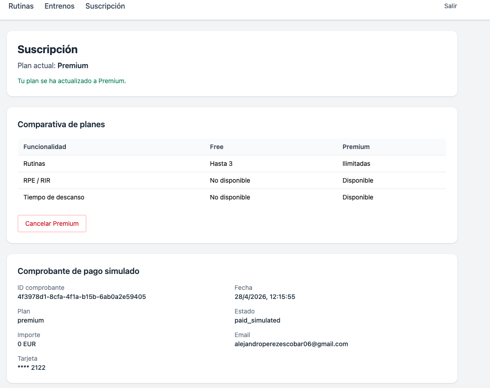
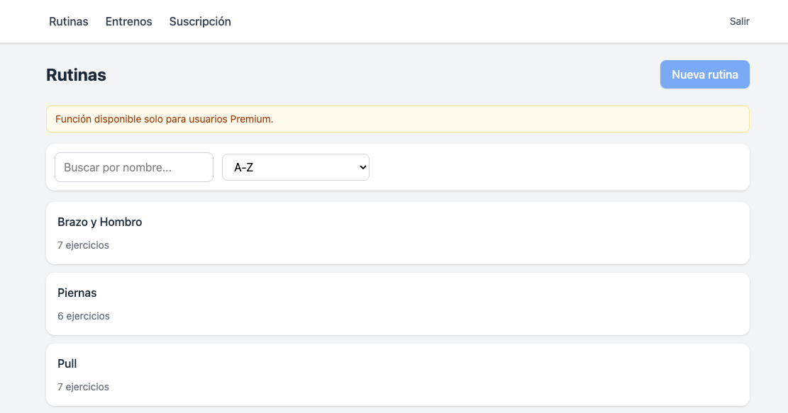

# 9. SSG

## 1. Introducción

FitTrack incorpora una funcionalidad empresarial de suscripción orientada a diferenciar capacidades entre usuarios Free y Premium.

La implementación se ha diseñado como un flujo seguro y demostrable en entorno académico: alta de plan Premium simulada, generación de comprobante y cancelación de suscripción.

Este apartado demuestra el cumplimiento de los criterios de SSG aplicados al proyecto.

---

## 2. Funcionalidad empresarial implementada

**Explicación aplicada al proyecto**  
Se implementa un sistema de suscripción con dos estados de cuenta (`free` y `premium`) gestionado desde backend Laravel y consumido por frontend Vue.

**Qué permite**

- Gestionar el cambio de plan del usuario autenticado  
- Aplicar reglas de negocio según el plan activo  
- Cubrir el ciclo mínimo de suscripción: alta, comprobante y cancelación  

**Por qué está bien implementado**  
La funcionalidad está integrada de extremo a extremo (API + interfaz + estado de sesión), con reglas claras y comportamiento verificable para defensa.

---

## 3. Sistema de planes Free / Premium

**Explicación aplicada al proyecto**  
El sistema distingue entre plan Free y plan Premium, reflejando el estado actual del usuario en la sesión y en la interfaz.

**Qué permite**

- Mostrar plan actual en la pantalla de suscripción  
- Ofrecer acciones según estado (`Hazte Premium` o `Cancelar Premium`)  
- Mantener coherencia entre backend y frontend mediante `auth/me`

**Por qué está bien implementado**  
El estado del plan no depende solo de la UI: se valida en backend y se sincroniza en frontend tras cada operación.

---

## 4. Flujo de alta a Premium

**Explicación aplicada al proyecto**  
El usuario Free puede iniciar un upgrade simulado desde un modal de pago. El frontend envía los datos a `POST /api/subscription/upgrade-simulated` y actualiza la sesión al finalizar.

**Qué permite**

- Ejecutar alta Free -> Premium con validaciones de formato  
- Evitar recompra si el usuario ya es Premium (`409`)  
- Mostrar comprobante de operación tras alta correcta

**Por qué está bien implementado**  
El flujo implementa validación, control de estado y feedback al usuario sin introducir pagos reales.

**Evidencia**

*Pantalla de suscripción con comparativa de planes y modal de alta Premium.*

---

## 5. Flujo de cancelación

**Explicación aplicada al proyecto**  
El usuario Premium puede cancelar su suscripción desde la misma pantalla mediante confirmación previa. La acción llama a `POST /api/subscription/cancel`.

**Qué permite**

- Ejecutar transición Premium -> Free  
- Evitar cancelaciones inconsistentes (`409`)  
- Refrescar la interfaz con el nuevo estado

**Por qué está bien implementado**  
Se cubre el cierre del ciclo de vida de la suscripción sin ambigüedad funcional y con control de errores en backend.

---

## 6. Seguridad aplicada

**Explicación aplicada al proyecto**  
Las operaciones de suscripción están protegidas para usuarios autenticados y se limita la persistencia de datos a información estrictamente necesaria.

**Qué permite**

- Proteger endpoints con `auth:sanctum`  
- No almacenar tarjeta completa ni CVV  
- Aplicar errores de negocio en estados inválidos

**Por qué está bien implementado**  
La seguridad se aplica tanto en autenticación como en reglas de negocio.

---

## 7. Comprobante de operación

**Explicación aplicada al proyecto**  
Tras un upgrade correcto, la API devuelve un comprobante mínimo (`receipt`) y el frontend lo muestra en pantalla.

**Qué permite**

- Mostrar identificador de operación  
- Fecha, plan, estado, importe y correo  
- Últimos 4 dígitos de tarjeta sin exponer datos sensibles

**Por qué está bien implementado**  
Aporta trazabilidad funcional sin añadir complejidad innecesaria.

**Evidencia**

*Usuario Premium activo con comprobante mostrado y opción de cancelación.*

---

## 8. Limitaciones y mejoras futuras

**Explicación aplicada al proyecto**  
La solución actual prioriza el cumplimiento funcional SSG en entorno académico, con un flujo simulado y seguro.

**Qué permite**

- Validar lógica empresarial sin cobro real  
- Demostrar monetización funcional  
- Mantener bajo riesgo técnico

**Por qué está bien implementado**  
El alcance está acotado y documentado de forma honesta.

---

## 9. Evidencia de restricciones Free / Premium

**Explicación aplicada al proyecto**  
El sistema no solo cambia el nombre del plan, sino que modifica funcionalidades reales disponibles para el usuario.

**Qué permite**

- Limitar funciones avanzadas en plan Free  
- Incentivar la mejora a Premium  
- Aplicar monetización funcional real dentro de la aplicación

**Por qué está bien implementado**  
Demuestra una diferencia tangible entre planes, no solo estética.

**Evidencia**

*Mensaje visible indicando funcionalidad exclusiva para usuarios Premium.*

---

## 10. Conclusión

El módulo SSG de FitTrack cumple el objetivo empresarial definido: gestión de planes Free/Premium con flujo de alta simulada, comprobante de operación y cancelación de suscripción, protegido mediante autenticación y reglas de negocio coherentes.

La implementación mantiene un enfoque realista y defendible: no incluye pasarela de pago real en esta fase, pero sí un ciclo funcional completo, verificable y alineado con el alcance académico del proyecto.
# 9. SSG

## 1. Introducción

FitTrack incorpora una funcionalidad empresarial de suscripción orientada a diferenciar capacidades entre usuarios Free y Premium.

La implementación se ha diseñado como un flujo seguro y demostrable en entorno académico: alta de plan Premium simulada, generación de comprobante y cancelación de suscripción.

Este apartado demuestra el cumplimiento de los criterios de SSG aplicados al proyecto.

---

## 2. Funcionalidad empresarial implementada

**Explicación aplicada al proyecto**  
Se implementa un sistema de suscripción con dos estados de cuenta (`free` y `premium`) gestionado desde backend Laravel y consumido por frontend Vue.

**Qué permite**

- Gestionar el cambio de plan del usuario autenticado  
- Aplicar reglas de negocio según el plan activo  
- Cubrir el ciclo mínimo de suscripción: alta, comprobante y cancelación  

**Por qué está bien implementado**  
La funcionalidad está integrada de extremo a extremo (API + interfaz + estado de sesión), con reglas claras y comportamiento verificable para defensa.

---

## 3. Sistema de planes Free / Premium

**Explicación aplicada al proyecto**  
El sistema distingue entre plan Free y plan Premium, reflejando el estado actual del usuario en la sesión y en la interfaz.

**Qué permite**

- Mostrar plan actual en la pantalla de suscripción  
- Ofrecer acciones según estado (`Hazte Premium` o `Cancelar Premium`)  
- Mantener coherencia entre backend y frontend mediante `auth/me`

**Por qué está bien implementado**  
El estado del plan no depende solo de la UI: se valida en backend y se sincroniza en frontend tras cada operación.

---

## 4. Flujo de alta a Premium

**Explicación aplicada al proyecto**  
El usuario Free puede iniciar un upgrade simulado desde un modal de pago. El frontend envía los datos a `POST /api/subscription/upgrade-simulated` y actualiza la sesión al finalizar.

**Qué permite**

- Ejecutar alta Free -> Premium con validaciones de formato  
- Evitar recompra si el usuario ya es Premium (`409`)  
- Mostrar comprobante de operación tras alta correcta

**Por qué está bien implementado**  
El flujo implementa validación, control de estado y feedback al usuario sin introducir pagos reales.

**Evidencia**

*Pantalla de suscripción con comparativa de planes y modal de alta Premium.*

---

## 5. Flujo de cancelación

**Explicación aplicada al proyecto**  
El usuario Premium puede cancelar su suscripción desde la misma pantalla mediante confirmación previa. La acción llama a `POST /api/subscription/cancel`.

**Qué permite**

- Ejecutar transición Premium -> Free  
- Evitar cancelaciones inconsistentes (`409`)  
- Refrescar la interfaz con el nuevo estado

**Por qué está bien implementado**  
Se cubre el cierre del ciclo de vida de la suscripción sin ambigüedad funcional y con control de errores en backend.

---

## 6. Seguridad aplicada

**Explicación aplicada al proyecto**  
Las operaciones de suscripción están protegidas para usuarios autenticados y se limita la persistencia de datos a información estrictamente necesaria.

**Qué permite**

- Proteger endpoints con `auth:sanctum`  
- No almacenar tarjeta completa ni CVV  
- Aplicar errores de negocio en estados inválidos

**Por qué está bien implementado**  
La seguridad se aplica tanto en autenticación como en reglas de negocio.

---

## 7. Comprobante de operación

**Explicación aplicada al proyecto**  
Tras un upgrade correcto, la API devuelve un comprobante mínimo (`receipt`) y el frontend lo muestra en pantalla.

**Qué permite**

- Mostrar identificador de operación  
- Fecha, plan, estado, importe y correo  
- Últimos 4 dígitos de tarjeta sin exponer datos sensibles

**Por qué está bien implementado**  
Aporta trazabilidad funcional sin añadir complejidad innecesaria.

**Evidencia**

*Usuario Premium activo con comprobante mostrado y opción de cancelación.*

---

## 8. Limitaciones y mejoras futuras

**Explicación aplicada al proyecto**  
La solución actual prioriza el cumplimiento funcional SSG en entorno académico, con un flujo simulado y seguro.

**Qué permite**

- Validar lógica empresarial sin cobro real  
- Demostrar monetización funcional  
- Mantener bajo riesgo técnico

**Por qué está bien implementado**  
El alcance está acotado y documentado de forma honesta.

---

## 9. Evidencia de restricciones Free / Premium

**Explicación aplicada al proyecto**  
El sistema no solo cambia el nombre del plan, sino que modifica funcionalidades reales disponibles para el usuario.

**Qué permite**

- Limitar funciones avanzadas en plan Free  
- Incentivar la mejora a Premium  
- Aplicar monetización funcional real dentro de la aplicación

**Por qué está bien implementado**  
Demuestra una diferencia tangible entre planes, no solo estética.

**Evidencia**

*Mensaje visible indicando funcionalidad exclusiva para usuarios Premium.*

---

## 10. Conclusión

El módulo SSG de FitTrack cumple el objetivo empresarial definido: gestión de planes Free/Premium con flujo de alta simulada, comprobante de operación y cancelación de suscripción, protegido mediante autenticación y reglas de negocio coherentes.

La implementación mantiene un enfoque realista y defendible: no incluye pasarela de pago real en esta fase, pero sí un ciclo funcional completo, verificable y alineado con el alcance académico del proyecto.